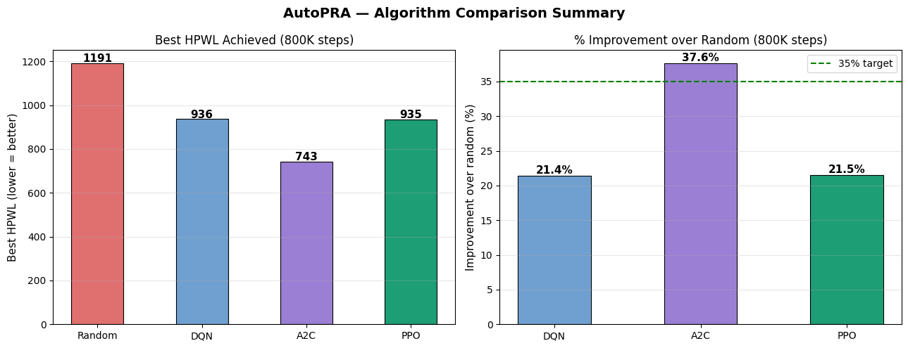
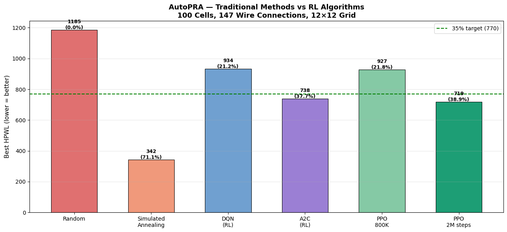
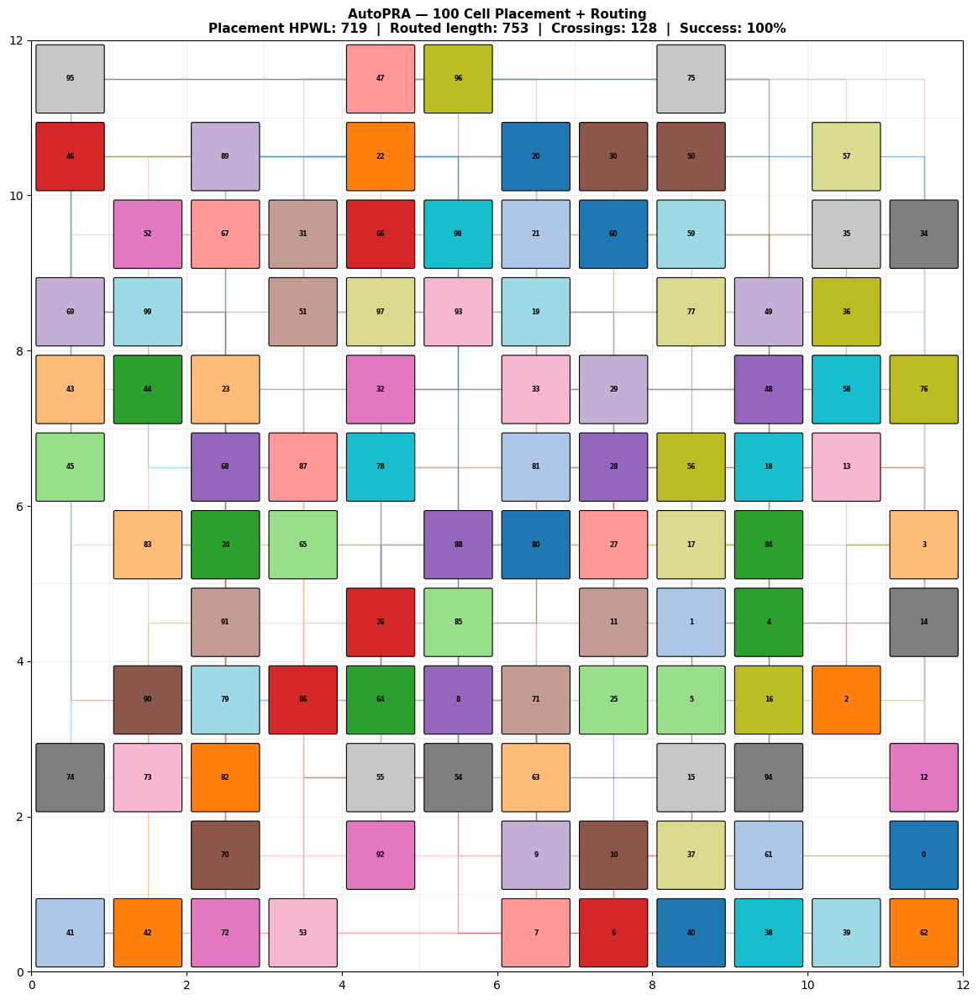
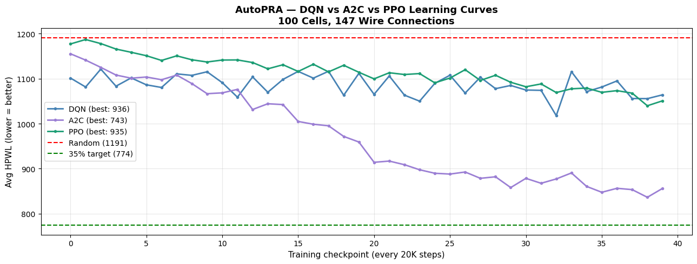

# \# AutoPRA

# 

# \*\*A Reinforcement Learning Framework for Placement and Routing Automation in VLSI\*\*

# 

# AutoPRA applies reinforcement learning (DQN, A2C, PPO) to the VLSI cell placement and routing problem, benchmarking against traditional methods like Simulated Annealing and real EDA tool outputs.

# 

# \## Overview

# 

# This repo contains two versions:

# 

# \- \*\*v1\*\* — Single-agent RL on a 100-cell synthetic netlist (12x12 grid). Includes DQN/A2C/PPO training, A\* routing, and comparison against Simulated Annealing.

# \- \*\*v2\*\* — Extended framework on real benchmarks: MCNC `cm138a` and CircuitNet RISC-V (RISCY-a-1-c2, 250-cell subset, 28x28 grid). Adds congestion-aware rewards and signal-integrity evaluation.

# 

# \## Results Summary

# 

# | Version | Best Method | HPWL Improvement |

# |---------|-------------|-------------------|

# | v1      | PPO         | 38.9% (vs random baseline) |

# | v2 (MCNC)      | PPO  | 39.7% |

# | v2 (CircuitNet) | PPO | up to 62.1% |

# 

# v1 also includes A\* routing with 100% success on 147 wire connections at 4.7% overhead.

# 

# \## Repository Structure

## Results

### v1 — Algorithm Comparison (100-cell synthetic netlist, 800K-step equal budget)

| Method | Mean HPWL | Improvement vs Random |
|--------|-----------|------------------------|
| Random | 1184 | 0% |
| DQN (800K) | — | 21.2% |
| A2C (800K) | — | 23.5% |
| PPO (800K) | — | 38.9% |
| Simulated Annealing | 342 | 70.8% |

### v2 — Real Benchmark Results (CircuitNet RISCY-a-1-c2, 250-cell subset)

| Method | HPWL | vs Random | Max Net Length | SI Violations |
|--------|------|-----------|------------------|----------------|
| Real EDA (gold) | 141,106 | — | 42.0 | 47.7% |
| Random | 157,395 | 0% | 49.0 | 82.7% |
| SA (classical) | 25,046.5 | 84.1% | 33.5 | 1.7% |
| AutoPRA (PPO) | 59,720 | 62.1% | 24.5 | 25.8% |

**Key finding:** PPO achieves 57% fewer signal-integrity violations than random placement, with the shortest max net length among RL-based methods (24.5 — a 50% reduction vs random).

*Note: all 8,707 nets in this subset are degree ≤3 (non-critical) — high-fanout critical nets connect to cells outside the 250-cell subset, expected for a RISC-V core at this scale.*

### v2 — MCNC cm138a Benchmark

- HPWL improvement: 39.7%
- Congestion: 0%

